# Rapport final - Taxi Driver / T-AIA

## 1. Introduction

Ce projet consiste à résoudre `Taxi-v3` à l'aide d'algorithmes d'apprentissage par renforcement de type model-free, c'est-à-dire sans connaissance préalable du modèle interne de l'environnement. Les agents apprennent uniquement à partir des états observés, des actions effectuées et des récompenses reçues. L'objectif est simple: apprendre une politique capable de récupérer un passager, le déposer à la bonne destination et le faire avec le moins d'étapes possible.

Dans ce rapport, l'expression apprentissage par renforcement (reinforcement learning, RL) est explicitée une fois, puis la formulation complète est privilégiée afin d'éviter toute ambiguïté.

La démarche n'est pas purement théorique. Elle suit un vrai cycle datascience:

1. définir le problème;
2. choisir des métriques pertinentes;
3. tester plusieurs agents;
4. comparer les résultats;
5. analyser les compromis performance / coût;
6. retenir un modèle final défendable en soutenance.

Le projet compare trois approches principales:

- une baseline naïve `BruteForce`;
- `Q-Learning`;
- `Double Q-Learning`.

Un `DQN` expérimental en NumPy existe dans le dépôt, mais il n'a pas été retenu comme solution finale.

## 2. Présentation de Taxi-v3

`Taxi-v3` est un environnement discret de Gymnasium. Il représente un taxi dans une grille avec:

- une position du taxi;
- une position du passager;
- une destination;
- un ensemble d'actions discrètes.

Les actions possibles sont:

- se déplacer vers le nord;
- se déplacer vers le sud;
- se déplacer vers l'est;
- se déplacer vers l'ouest;
- effectuer un `pickup`;
- effectuer un `dropoff`.

Les récompenses natives de `Taxi-v3` sont:

- `+20` lorsque le passager est correctement déposé;
- `-1` à chaque action;
- `-10` lors d'un `pickup` ou `dropoff` invalide.

L'objectif de l'agent est donc de maximiser la récompense cumulée, ce qui revient concrètement à:

- réduire le nombre d'étapes;
- éviter les actions inutiles;
- atteindre le dépôt final avec succès.

## 3. Métriques retenues

Les métriques de performance seules ne suffisent pas. Deux agents peuvent avoir des scores proches mais des coûts de calcul très différents. Le choix final doit donc prendre en compte la qualité de la politique et son coût matériel.

| Métrique | Rôle | Pourquoi elle est utile |
| --- | --- | --- |
| Récompense moyenne | Mesure globale de la qualité de la politique | Elle résume directement la capacité à résoudre la tâche |
| Nombre moyen de steps | Mesure l'efficacité opérationnelle | Un agent qui résout vite est préférable |
| Success rate | Taux de réussite sur les épisodes de test | Indique la robustesse du comportement |
| Temps d'entraînement | Coût de construction de la politique | Important pour juger la faisabilité du protocole |
| Temps d'évaluation | Coût pour rejouer une politique apprise | Utile pour comparer l'usage réel des modèles |
| Taille du modèle | Coût mémoire du stockage | Permet de comparer tabulaire vs réseau |
| Peak memory / RSS | Empreinte mémoire du processus | Mesure simple et fiable du coût hardware |
| Temps CPU | Coût de calcul du processus | Complète le temps mur pour l'analyse du coût |

Les manifests des runs enregistrent ces informations. Dans le choix final, les métriques les plus discriminantes ont été la récompense moyenne, le nombre de steps, le success rate, puis le coût de calcul.

## 4. Algorithmes étudiés

### 4.1 BruteForceAgent

`BruteForceAgent` joue des actions aléatoires. Il ne possède pas de politique apprise.

Son intérêt est purement méthodologique:

- il fournit un point de comparaison naïf;
- il montre ce que vaut une stratégie sans apprentissage;
- il permet de mesurer le gain réel apporté par l'apprentissage par renforcement.

Comme attendu, il reste très mauvais sur `Taxi-v3`:

- il consomme beaucoup d'étapes;
- il obtient une récompense fortement négative;
- il sert de borne basse.

### 4.2 Q-Learning

`Q-Learning` est l'algorithme principal de ce projet. Il apprend une table `Q(s, a)` qui associe à chaque état et à chaque action une valeur estimée.

Cette approche est bien adaptée à `Taxi-v3` parce que l'environnement est discret. Il n'est donc pas nécessaire d'introduire un réseau de neurones pour représenter la politique.

L'agent suit une politique `epsilon-greedy` pendant l'entraînement:

- avec probabilité `epsilon`, il explore;
- sinon, il choisit l'action la plus prometteuse selon la table `Q`.

Équation de mise à jour:

```text
Q(s,a) ← Q(s,a) + α [ r + γ max(Q(s',a')) − Q(s,a) ]
```

- `α` : taux d'apprentissage;
- `γ` : facteur de réduction;
- `r` : récompense reçue;
- `max(Q(s',a'))` : meilleure valeur estimée pour l'état suivant.

Cette formule est au cœur du projet et doit être comprise en soutenance.

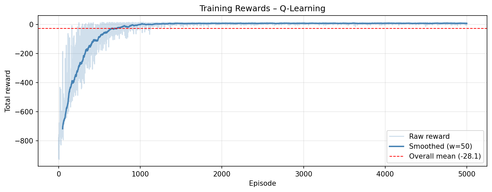

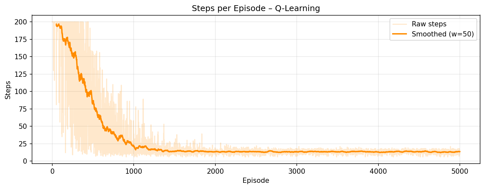

### 4.3 Double Q-Learning

`Double Q-Learning` conserve deux tables `Q_A` et `Q_B`. L'idée est de réduire le biais de maximisation introduit par la sélection de `max(Q)` dans Q-Learning.

L'intérêt théorique est réel:

- l'estimation peut être moins optimiste;
- le mécanisme est plus robuste dans certains contextes;
- la comparaison avec Q-Learning est pertinente sur un sujet d'apprentissage par renforcement.

En pratique, sur ce protocole Taxi-v3, la version double n'apporte pas un meilleur compromis global que le Q-Learning retenu.

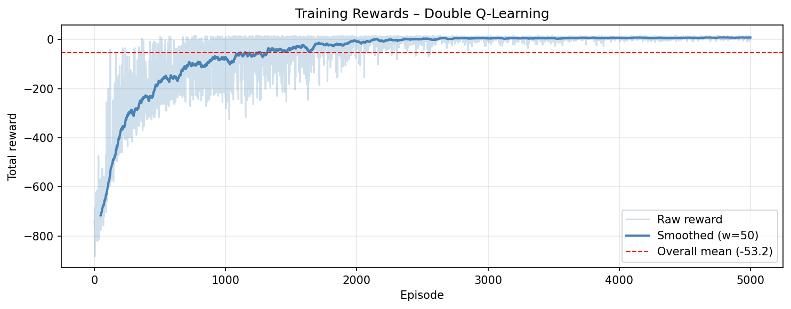

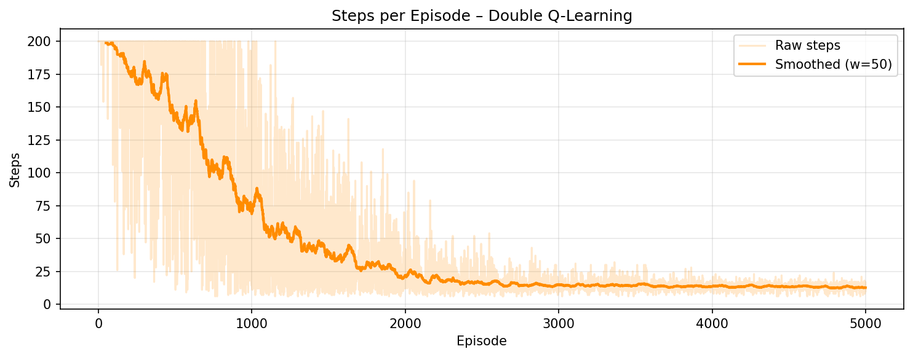

### 4.4 DQN

Le `DQN` remplace la table `Q` par une approximation par réseau de neurones. L'idée générale est utile, mais la solution présente ici reste expérimentale et en NumPy.

Le `DQN` n'a pas été retenu comme solution finale:

- il ajoute de la complexité;
- il est plus coûteux à entraîner;
- il n'apporte pas, ici, un meilleur compromis performance / coût / simplicité.

Il reste utile comme comparaison secondaire et comme piste d'extension.

## 5. Démarche expérimentale

La démarche a suivi un ordre progressif.

### 5.1 Baseline brute force

La première étape a consisté à mesurer la performance d'une stratégie aléatoire. Cette baseline donne un repère concret: sans apprentissage, le problème reste très difficile.

### 5.2 Q-Learning

Le second axe a été d'implémenter puis de tuner `Q-Learning` manuellement.

Les hyperparamètres étudiés ont été:

- `alpha`;
- `gamma`;
- `epsilon`;
- `epsilon_min`;
- `epsilon_decay`;
- le nombre d'épisodes;
- le nombre maximal de steps.

L'optimisation a été manuelle. Aucune solution automatique lourde de type Optuna ou Ray Tune n'a été utilisée.

### Essais d'hyperparamètres

Le choix final ne sort pas de nulle part: plusieurs réglages ont été comparés avant de retenir la configuration finale. Le tableau ci-dessous résume les tendances observées pendant les essais.

| Paramètre testé | Valeurs / configurations comparées | Observation | Décision |
| --------------- | ---------------------------------- | ----------- | -------- |
| `alpha` | valeur faible, valeur intermédiaire, valeur plus forte | Une valeur trop faible ralentit l'apprentissage; une valeur trop élevée rend les mises à jour plus bruitées | Retenir un compromis stable autour de `0.1` à `0.15` |
| `gamma` | valeur plus basse, valeur élevée | Une valeur élevée est mieux adaptée à Taxi-v3, car plusieurs actions sont souvent nécessaires avant la récompense finale | Retenir `0.99` |
| `epsilon_decay` | décroissance rapide, décroissance lente | Une décroissance trop rapide réduit l'exploration trop tôt; une décroissance trop lente retarde l'exploitation | Retenir une décroissance progressive |
| Nombre d'épisodes | runs plus courts, runs plus longs | Les runs courts restent lisibles mais convergent moins bien; les runs plus longs stabilisent mieux les courbes | Retenir `5000` épisodes pour le benchmark principal |
| Max steps | seuil plus faible, seuil standard | Un seuil trop faible coupe des épisodes encore utiles; un seuil trop élevé n'apporte pas de gain réel sur Taxi-v3 | Retenir `200` steps par épisode |

#### Analyse des hyperparamètres

Les réglages retenus ne sont pas arbitraires. Ils correspondent à un compromis observé sur les courbes d'apprentissage et sur les runs finaux.

- `alpha = 0.1` donne des mises à jour suffisamment réactives sans rendre la table instable. Une valeur plus forte accélère l'apprentissage au début mais rend les Q-values plus bruitées. Une valeur plus faible apprend trop lentement.
- `gamma = 0.99` favorise la planification à moyen terme, ce qui est cohérent avec Taxi-v3: il faut souvent enchaîner plusieurs actions avant d'obtenir la récompense finale.
- `epsilon` démarre haut pour obliger l'exploration, puis descend jusqu'à `0.01` pour basculer vers l'exploitation une fois la table suffisamment renseignée.
- `epsilon_min = 0.01` évite un arrêt total de l'exploration tout en laissant l'agent stabiliser sa politique.
- `epsilon_decay = 0.995` produit une transition progressive entre exploration et exploitation. Dans les courbes, cette transition est visible: la performance s'améliore nettement quand l'agent n'agit plus presque au hasard.
- `5000` épisodes donnent assez de volume pour que la politique se stabilise. Les runs plus courts restent lisibles, mais leurs courbes plafonnent plus haut et convergent moins bien.
- `200` steps par épisode fixent une borne de sécurité et empêchent les épisodes sans fin.

### 5.3 Double Q-Learning

Une fois Q-Learning stabilisé, `Double Q-Learning` a été testé pour vérifier si la réduction du biais de maximisation apportait un gain réel sur Taxi-v3.

### 5.4 Tests exploratoires sur DQN

Le DQN a été conservé comme piste expérimentale. Il est utile pour la culture projet et pour la comparaison conceptuelle, mais il ne justifie pas de devenir la solution finale.

Les configurations DQN sont plus sensibles que les méthodes tabulaires, notamment sur:

- `learning rate`;
- `batch_size`;
- `buffer_size`;
- `target_update_freq`;
- `hidden_sizes`.

Dans Taxi-v3, ce type d'approche peut devenir plus coûteux à régler sans apporter un gain suffisant sur un espace d'état discret et fini. La solution tabulaire reste donc plus pragmatique pour ce rendu.

| Configuration DQN | Observation | Décision |
| ----------------- | ----------- | -------- |
| Petite architecture et apprentissage rapide | Convergence instable et besoin de réglages fins | Non retenu |
| Architecture plus large et buffer plus important | Coût plus élevé sans amélioration suffisamment claire | Non retenu |
| DQN expérimental conservé comme comparaison | Intéressant pour la culture projet, mais moins adapté au contexte Taxi-v3 | Gardé comme piste secondaire |

### 5.5 Comparaison finale

La sélection finale s'appuie sur:

- les manifests des vrais runs finaux;
- les modèles finaux conservés dans `artifacts/final_models/`;
- les graphiques générés pendant les runs;
- le benchmark final du projet.

## 6. Résultats finaux

Les valeurs ci-dessous proviennent des vrais runs finaux retenus pour le rendu.

| Agent | Mean Reward | Mean Steps | Success Rate | Training Time | Eval Time | Model Size | Peak Memory |
| --- | ---: | ---: | ---: | ---: | ---: | ---: | ---: |
| Q-Learning | 7.74 | 13.26 | 100 % | 1.90 s | 0.0195 s | 24 128 B | 98.7 MB |
| Double Q-Learning | 3.84 | 16.74 | 98 % | 4.10 s | 0.0409 s | 48 256 B | 105.3 MB |
| Brute Force | -765.22 | 196.39 | 5 % | 13.51 s | 0.268 s | N/A | 101.2 MB |

Le `Q-Learning` obtient la meilleure récompense moyenne, le plus faible nombre d'étapes, un taux de réussite de 100 %, et le meilleur compromis entre performance, simplicité et coût de calcul.

Le benchmark final du projet confirme la tendance générale et montre que les deux méthodes tabulaires convergent vers une politique efficace, alors que la baseline brute force reste très loin derrière.

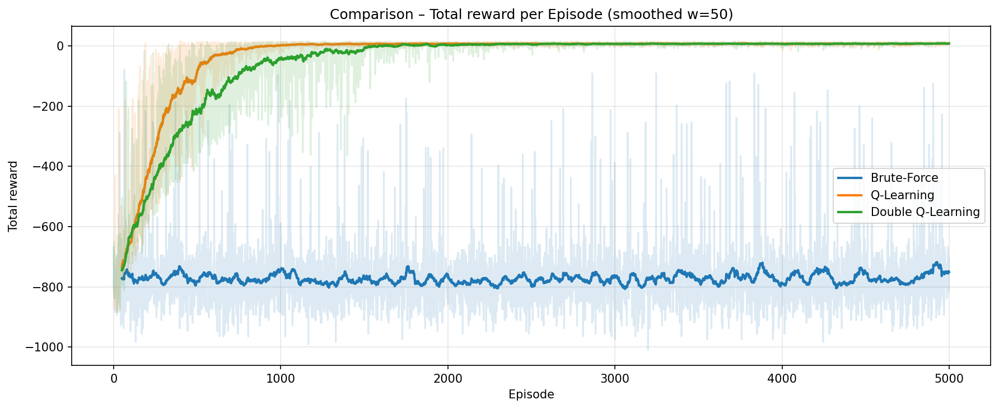

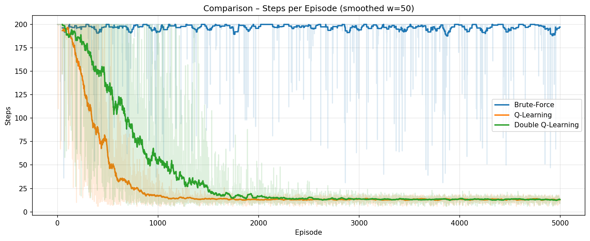

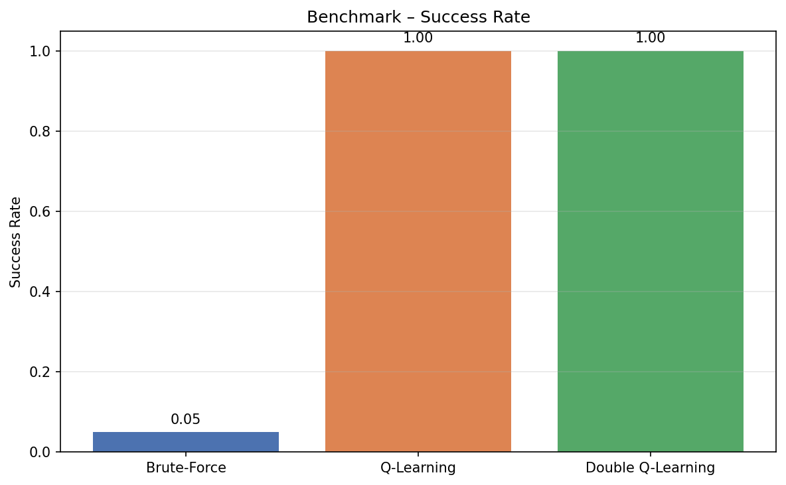

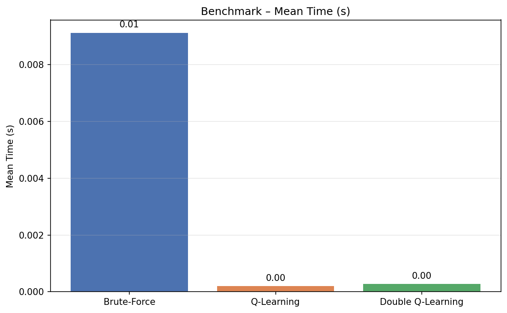

## 7. Analyse

### Lecture des courbes d'apprentissage

Les courbes d'apprentissage racontent la même histoire que les métriques finales.

Au début du training, les récompenses restent très négatives et les épisodes demandent beaucoup d'étapes. C'est normal: la table `Q` est encore peu informative et l'agent explore presque tout l'espace des actions. Avec `epsilon` élevé, les choix sont volontairement bruyants.

Ensuite, les courbes s'améliorent en deux phases:

1. l'agent découvre des trajectoires valides plus souvent;
2. les mises à jour successives renforcent les actions qui mènent au succès et pénalisent les séquences inefficaces.

Quand `epsilon` diminue, la politique devient plus stable. Les épisodes réussis deviennent plus fréquents, les steps moyens baissent, et la récompense moyenne remonte. Cette progression est visible dans les courbes `Q-Learning` et `Double Q-Learning`.

Sur `Double Q-Learning`, la progression reste similaire mais plus lente et moins avantageuse. Le mécanisme à deux tables réduit certains biais, mais il dilue aussi le rythme de consolidation de la politique dans ce contexte précis.

Le plateau final a une interprétation simple: l'agent a trouvé une politique suffisamment bonne pour Taxi-v3, et les mises à jour supplémentaires n'apportent plus qu'un gain marginal.

### Hyperparamètres et dynamique

Les hyperparamètres influencent directement la forme des courbes:

- un `alpha` trop élevé ferait remonter la variance des courbes;
- un `alpha` trop faible ralentirait la montée de performance;
- un `gamma` trop faible casserait la planification et garderait des courbes basses;
- un `epsilon_decay` trop rapide ferait chuter l'exploration avant que la table ne soit exploitable;
- un `epsilon_decay` trop lent garderait l'agent trop aléatoire et décalerait le plateau vers la droite.

Le protocole retenu évite ces deux extrêmes. Il donne une montée progressive, puis une stabilisation cohérente avec le budget d'épisodes.

### Pourquoi Q-Learning gagne

Le problème est discret, relativement petit et parfaitement compatible avec une approche tabulaire. Dans ce cadre, Q-Learning a plusieurs avantages:

- la représentation est simple;
- l'algorithme converge vite;
- le modèle est facile à expliquer;
- le coût mémoire est faible;
- l'évaluation est très rapide.

### Pourquoi Double Q-Learning ne prend pas l'avantage

Double Q-Learning est théoriquement intéressant, mais ici il ne surclasse pas la version simple. Il ajoute:

- une seconde table;
- plus de mémoire;
- plus de complexité;
- un coût d'entraînement plus élevé.

Sur le protocole retenu, ce surcoût n'est pas compensé par un gain de performance suffisant.

### Pourquoi Brute Force est utile malgré sa faiblesse

La baseline brute force reste indispensable:

- elle matérialise la difficulté du problème sans apprentissage;
- elle montre le gain apporté par l'apprentissage par renforcement;
- elle permet d'éviter une lecture trop optimiste des résultats.

### Coût de calcul

Le coût de calcul a été intégré au raisonnement final. Le `Q-Learning` final est plus léger:

- modèle plus petit;
- temps d'entraînement plus faible;
- évaluation très rapide;
- mémoire plus faible que la version double.

Le `Double Q-Learning` reste acceptable comme comparaison, mais il n'apporte pas un meilleur compromis global.

Le `DQN` serait encore plus coûteux conceptuellement et en mise au point. Dans ce projet, il ne justifie pas d'être la solution finale.

### Coût computationnel

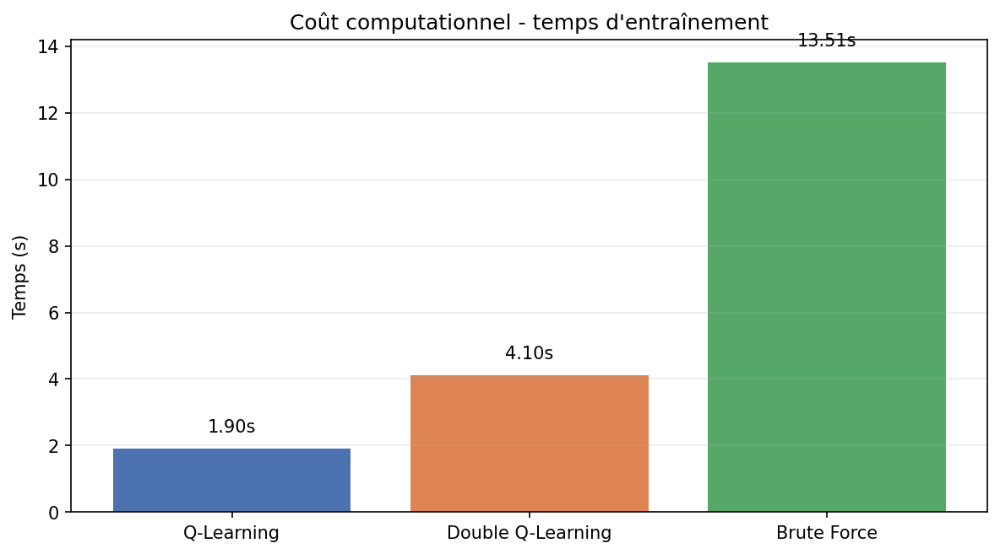

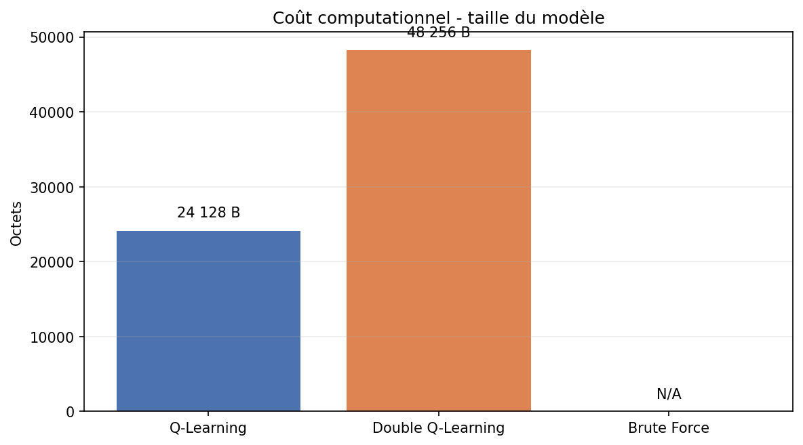

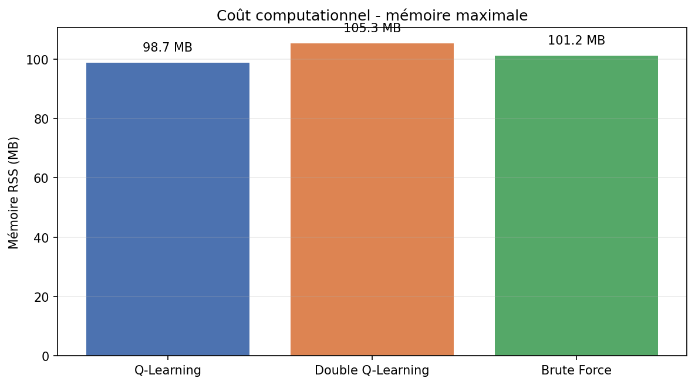

Ces graphes confirment plusieurs points utiles pour la soutenance:

- `Q-Learning` est le modèle le plus léger parmi les approches apprenantes;
- `Double Q-Learning` double pratiquement le coût mémoire du stockage des tables;
- la baseline brute force ne stocke pas de modèle, mais elle reste coûteuse en temps d'exécution parce qu'elle ne gagne rien en efficacité;
- le coût computationnel ne suit pas exactement la performance, ce qui justifie de le prendre en compte dans la décision finale.

## 8. Synthèse finale

| Agent | Performance | Coût | Complexité | Décision |
| --- | --- | --- | --- | --- |
| Q-Learning | Meilleure récompense moyenne, moins de steps, 100 % de réussite | Le plus faible coût global parmi les agents apprenants | Faible: une seule table, une mise à jour simple | Retenu |
| Double Q-Learning | Résultat proche mais inférieur sur le protocole retenu | Plus coûteux en mémoire et en temps | Moyenne: deux tables, logique plus lourde | Comparaison utile |
| Brute Force | Très loin derrière en performance | Temps élevé pour aucune politique apprise | Faible en structure, mais inefficace en pratique | Baseline |

## 9. Modèle final retenu

Le modèle retenu pour le rendu est:

```text
artifacts/final_models/qlearning_best.npy
```

Les modèles de comparaison conservés sont:

```text
artifacts/final_models/double_qlearning_best_A.npy
artifacts/final_models/double_qlearning_best_B.npy
```

Le catalogue final est décrit dans:

```text
artifacts/final_models/metadata.json
```

## 10. Limites du projet

Ce projet est solide pour une soutenance, mais il garde des limites assumées:

- l'environnement reste `Taxi-v3` standard;
- le DQN est expérimental et non retenu;
- l'optimisation d'hyperparamètres est manuelle;
- le benchmark hardware reste simple et volontairement non scientifique;
- les résultats sont spécifiques au protocole retenu.

Ces limites sont acceptables pour le rendu, car elles gardent le projet lisible et défendable.

## 11. Conclusion

Le projet répond à l'objectif principal: apprendre une politique efficace sur `Taxi-v3` avec une approche model-free simple et exploitable.

La comparaison entre les agents montre clairement que:

- la baseline brute force ne suffit pas;
- `Double Q-Learning` est une comparaison pertinente mais pas la meilleure solution finale ici;
- `Q-Learning` offre le meilleur équilibre entre performance, simplicité, interprétabilité et coût.

Le choix final est donc cohérent avec les résultats observés et avec les contraintes du rendu:

- meilleur score final;
- bonne stabilité;
- coût calcul raisonnable;
- explication claire en soutenance.

## 12. Annexes - fichiers et artefacts utiles

### Runs finaux

- `outputs/20260612_161504_qlearningagent_7597af`
- `outputs/20260612_161516_doubleqlearningagent_fa1abf`
- `outputs/20260612_161534_bruteforceagent_823be9`

### Figures de travail

- `docs/images/qlearning_rewards.png`
- `docs/images/qlearning_steps.png`
- `docs/images/qlearning_epsilon.png`
- `docs/images/double_qlearning_rewards.png`
- `docs/images/double_qlearning_steps.png`
- `docs/images/double_qlearning_epsilon.png`
- `docs/benchmarks/comparison_rewards.png`
- `docs/benchmarks/comparison_steps.png`
- `docs/benchmarks/benchmark_reward.png`
- `docs/benchmarks/benchmark_steps.png`
- `docs/benchmarks/benchmark_success.png`
- `docs/benchmarks/benchmark_time.png`

### Modèles finaux

- `artifacts/final_models/qlearning_best.npy`
- `artifacts/final_models/double_qlearning_best_A.npy`
- `artifacts/final_models/double_qlearning_best_B.npy`
